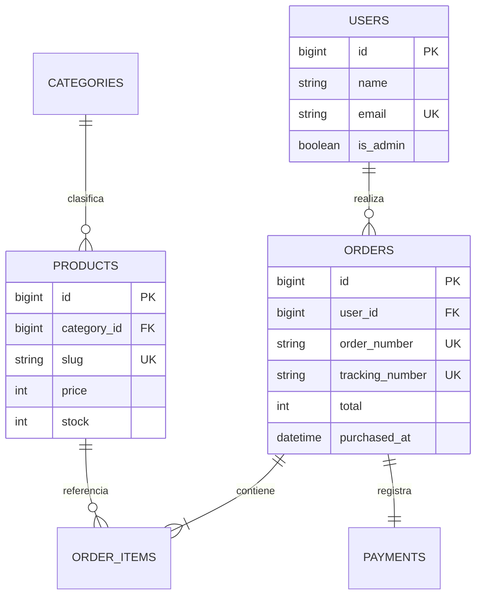
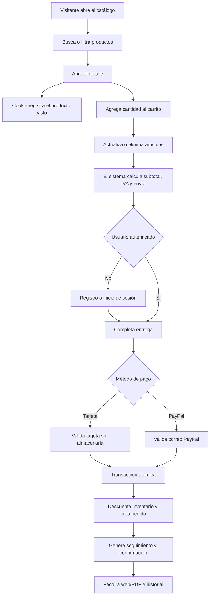

# Manual técnico y de uso - Café Salas

## 1. Descripción

Café Salas es una aplicación de comercio electrónico para café y productos artesanales de Costa Rica. Resuelve el recorrido completo: descubrimiento del producto, autenticación, carrito, cálculo de totales, pago académico, factura, seguimiento e historial. El panel administrativo permite observar ventas, actualizar estados y producir reportes PDF.

El diseño del código sigue los conceptos estudiados en las sesiones 9 y 10: arquitectura MVC, rutas nombradas y agrupadas, controladores, vistas Blade, migraciones, Eloquent ORM, relaciones, `$fillable`, casts, validación, middleware y paginación.

## 2. Tecnologías

- Backend: PHP 8.2 y Laravel 12.
- Base principal y de pruebas: SQLite.
- Frontend: HTML5 semántico, Blade, Bootstrap 5.3, CSS responsive y JavaScript.
- Servidor: Apache o servidor de desarrollo Artisan.
- PDF: Dompdf sin acceso a recursos remotos.
- Pruebas: PHPUnit integrado con Laravel.

## 3. Instalación principal con SQLite

1. Instale PHP 8.2 o superior y Composer.
2. En la terminal del proyecto ejecute `composer install`.
3. Copie `.env.example` a `.env` y ejecute `php artisan key:generate`.
4. Cree `database/database.sqlite` si todavía no existe.
5. Verifique `DB_CONNECTION=sqlite` y `DB_DATABASE=database/database.sqlite`.
6. Ejecute `php artisan migrate:fresh --seed`.
7. Ejecute `php artisan serve` y abra `http://127.0.0.1:8000`.

`.gitignore` excluye el archivo SQLite, `.env` y `.env.backup`, por lo que ninguna configuración local se publica.

## 4. Ejecución directa en Apache

Use `deployment/apache-vhost.conf.example`. Cambie la ruta del proyecto y agregue el bloque al archivo `C:\xampp\apache\conf\extra\httpd-vhosts.conf`. Verifique que `httpd.conf` incluya `httpd-vhosts.conf` y que `mod_rewrite` esté activo. Agregue `127.0.0.1 cafe-salas.test` a `C:\Windows\System32\drivers\etc\hosts` y reinicie Apache.

El `DocumentRoot` debe terminar en `/public`. Esto evita que `.env`, `vendor` y otros archivos privados sean accesibles desde el navegador.

### Publicación académica en Vercel y Neon

La versión local y las pruebas conservan SQLite como base principal. Para la URL pública, Vercel ejecuta PHP mediante `vercel-php` y Neon mantiene los datos en PostgreSQL, ya que el sistema de archivos serverless no ofrece persistencia para SQLite.

La demostración está disponible en [cafe-salas.vercel.app](https://cafe-salas.vercel.app) y el código se mantiene en [github.com/frank771-ai/cafe-salas](https://github.com/frank771-ai/cafe-salas).

1. Vincule el repositorio con Vercel y conecte el proyecto de Neon.
2. Configure las variables descritas en `deployment/env.vercel.example` para Production y Preview.
3. Mantenga `DATABASE_URL` como secreto y establezca `DB_CONNECTION=pgsql`. Si el cliente de Vercel no admite SNI, codifique el identificador del endpoint en la contraseña siguiendo `deployment/env.vercel.example`.
4. Genere una `APP_KEY` exclusiva y active cookies seguras.
5. Despliegue; el script `vercel` de Composer ejecuta migraciones y seeders idempotentes.
6. Sustituya `APP_URL` por el dominio final y realice un nuevo despliegue.

`ALLOW_SIMULATED_PAYMENTS_IN_PRODUCTION=true` se utiliza únicamente para esta demostración académica. No habilita ni conecta cobros reales.

## 5. Arquitectura MVC

- **Modelos (`app/Models`)**: representan usuarios, categorías, productos, pedidos, detalles y pagos. Las relaciones `hasMany`, `belongsTo` y `hasOne` expresan el modelo relacional.
- **Vistas (`resources/views`)**: plantillas Blade. Escapan la salida con `{{ }}` para prevenir XSS y reutilizan el componente `product-card`.
- **Controladores (`app/Http/Controllers`)**: reciben solicitudes, validan, consultan modelos y devuelven respuestas o vistas.
- **Rutas (`routes/web.php`)**: tienen nombres, verbos HTTP correctos y grupos `guest`, `auth` y `admin`.
- **Migraciones (`database/migrations`)**: versionan y reconstruyen el esquema SQLite.
- **Servicios (`app/Services`)**: concentran carrito, PDF, pago simulado, cookie reciente y estados de pedido.
- **Middleware**: controla acceso administrativo y agrega encabezados de seguridad.

## 6. Modelo de datos



Los precios se almacenan como enteros en colones, lo que evita errores de punto flotante. `order_items` conserva nombre y precio histórico aunque el producto cambie posteriormente.

## 7. Caso de uso: proceso de compra



### Actores

- Visitante: navega, filtra, observa productos recientes, maneja carrito y se registra.
- Cliente: además compra, modifica perfil y revisa pedidos/facturas.
- Administrador: observa ventas, cambia estados y genera reportes.
- Pasarela simulada: aprueba tarjeta o PayPal sin cargos reales.

## 8. Reglas del negocio

- IVA: 13 % del subtotal.
- Envío: ₡2.500; gratuito cuando el subtotal alcanza ₡20.000.
- El carrito no permite superar el inventario.
- En la compra se vuelve a validar y bloquear el inventario dentro de una transacción.
- Solo el dueño del pedido o un administrador puede abrir la factura.
- Los reportes omiten pedidos cancelados.
- La cookie conserva como máximo seis identificadores durante 30 días.
- Los estados no pueden saltar etapas; cancelar antes del envío repone inventario una sola vez.

## 9. Guía de uso

### Cliente

1. Abra Catálogo y use nombre, categoría, precio u orden.
2. Abra un producto, indique cantidad y agréguelo.
3. En Carrito actualice cantidades o elimine productos.
4. Inicie sesión o cree una cuenta.
5. Complete entrega, seleccione Tarjeta o PayPal y confirme.
6. Copie el número de seguimiento y descargue la factura.
7. En Mi perfil actualice datos o revise el historial.

### Administrador

1. Ingrese con `admin@cafesalas.test` / `Admin123!`.
2. Abra Administración para revisar métricas e inventario bajo.
3. Cambie el estado de un pedido y guarde.
4. Abra Reportes PDF y seleccione mes o cliente.

## 10. Seguridad

- Validación de servidor en todo formulario y límites de longitud/cantidad.
- Eloquent y enlaces preparados contra inyección SQL.
- Escape Blade contra XSS y token CSRF en solicitudes mutables.
- Hash seguro de contraseñas y regeneración de sesión al autenticar.
- Sesiones y cookies cifradas, `HttpOnly` y `SameSite=Lax`.
- Límites de intentos para registro, inicio de sesión, carrito, perfil, compra, estados y reportes.
- Middleware de administrador y autorización por propietario.
- Encabezados CSP, `nosniff`, `SAMEORIGIN`, `Referrer-Policy`, caché privada y HSTS en HTTPS.
- El número, vencimiento y CVV no se almacenan ni quedan en la sesión; solo los últimos cuatro dígitos.
- La pasarela académica se bloquea por defecto cuando `APP_ENV=production`.

Para producción use `deployment/env.production.example` y `deployment/apache-ssl-vhost.conf.example`: establezca `APP_ENV=production`, `APP_DEBUG=false`, `APP_URL=https://...`, `ALLOW_SIMULATED_PAYMENTS_IN_PRODUCTION=false` y `SESSION_SECURE_COOKIE=true`. Laravel fuerza `https`. En un hosting con dominio, emita un certificado gratuito mediante Let's Encrypt/Certbot o el panel del proveedor y active la renovación automática.

## 11. Comandos de mantenimiento

```powershell
php artisan migrate
php artisan db:seed
php artisan test
php vendor/bin/pint --test
php artisan optimize:clear
php artisan optimize
```

`migrate:fresh --seed` elimina y reconstruye todas las tablas; úselo solo sobre una base de desarrollo que pueda perderse.

## 12. Relación con los contenidos del curso

La estructura fue adaptada a partir de los conceptos de las sesiones 9 (frameworks backend, Laravel, migraciones, modelos y relaciones) y 10 (autenticación, rutas, controladores, componentes Blade, validación, CRUD y paginación). El equipo debe leer el código, ejecutar las pruebas y explicar sus decisiones durante la exposición.
